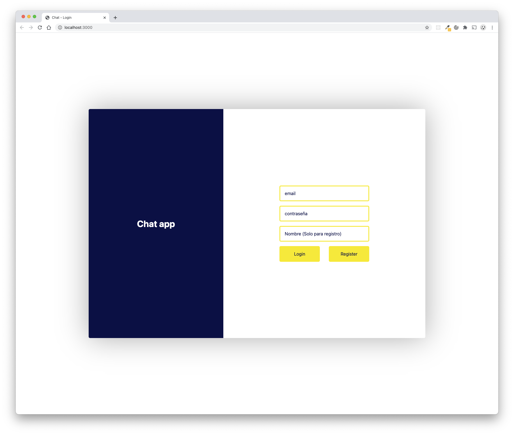
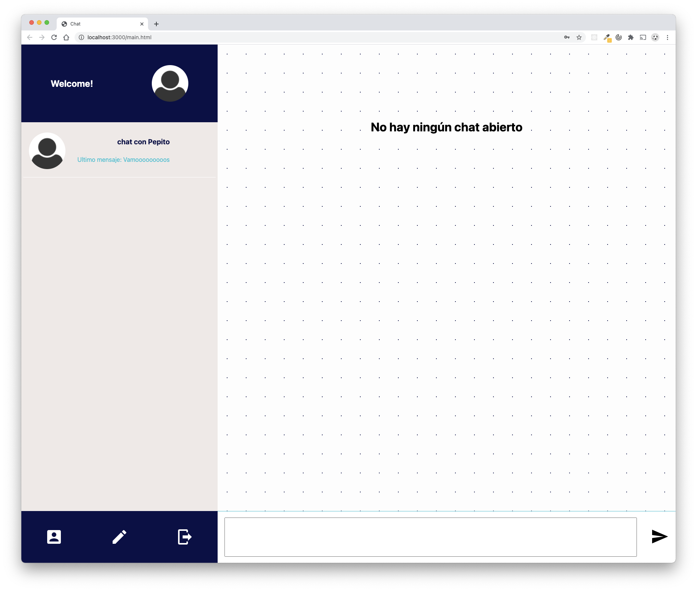
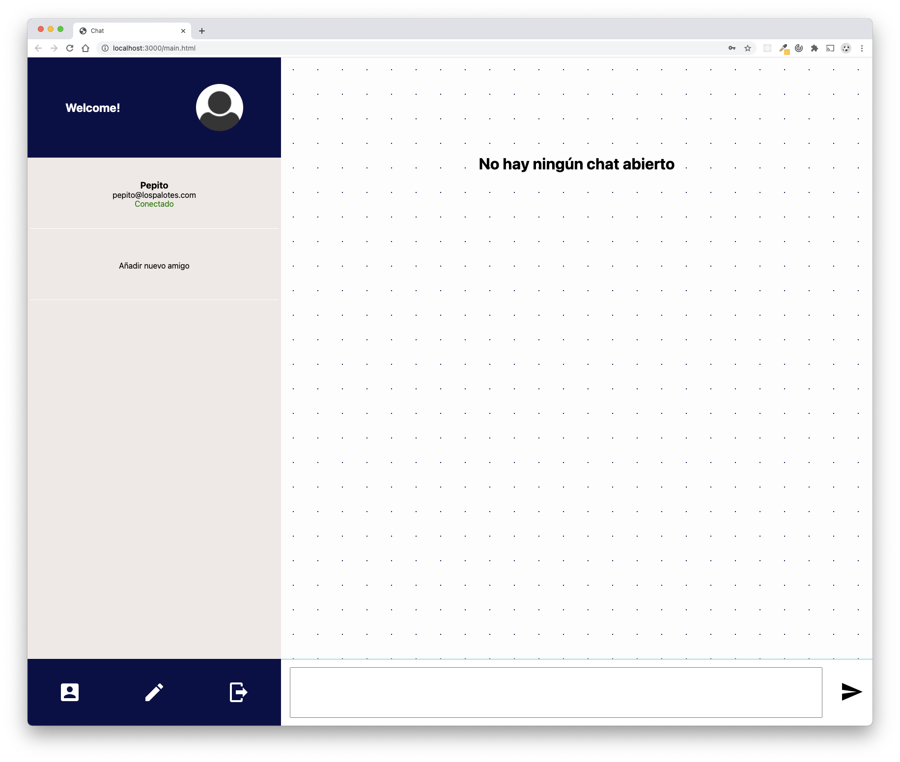
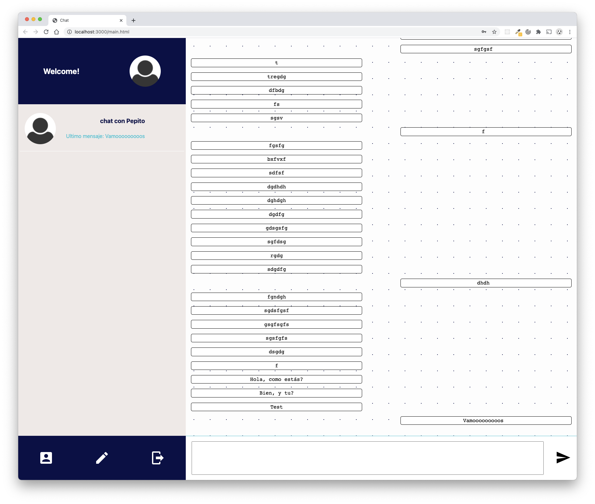

## Chat

Este proyecto es un chat para tener conversaciones con otras personas de forma simultanea similar a Whatsapp web.

### Login y registro

<p align="center">
  
</p>

### Chat

<p align="center">
  
  
  
</p>

## Tech stack

**Front End:**

- HTML, CSS y JavaScript
- [Socket IO](https://socket.io/)

**Back End:**

- [NodeJS](https://nodejs.org/es/)
- [ExpressJS](https://expressjs.com/es/)
- [Mongoose](https://mongoosejs.com/)

## Uso de la API Rest

La API Rest dispone de 5 rutas:

- `/login`: Es necesario enviar dos parametros en los searchParams, el email y el password. Devuelve el un objeto con el id del usuario logueado. Ejemplo de uso:

```javascript
// API CALL
const url = new URL(`${baseURL}login`);
const params = { email, password };

Object.keys(params).forEach((key) => url.searchParams.append(key, params[key]));

const result = await fetch(url);

// API RESULT
const { id } = await result.json();
```

- `/register`: Es necesario enviar 3 parametros en el body. email, password y name. Devuelve un string con el id del usuario. Ejemplo de uso:

```javascript
//API CALL
const email = document.getElementById("email").value;
const password = document.getElementById("password").value;
const name = document.getElementById("name").value;

const url = new URL(`${baseURL}register`);

const result = await fetch(url, {
  method: "post",
  headers: {
    Accept: "application/json",
    "Content-Type": "application/json",
  },
  body: JSON.stringify({
    email,
    password,
    name,
  }),
});

// API RESULT
const id = await result.json();
```

- `/getData`: Es necesario enviar un parametro en los searchParams, el email. Devuelve un objeto con las keys friends y chats. Ejemplo de uso:

```javascript
// API CALL
const url = new URL(`${baseURL}getData`);
const params = { email };

Object.keys(params).forEach((key) => url.searchParams.append(key, params[key]));
const result = await fetch(url);

// API RESULT
const { friends, chats } = await result.json();
saveData({ friends, chats });
```

- `/addFriend`: Es necesario enviar dos parametros en el body, el email y que el id de tu usuario. Devuelve un status 201 sin ningún dato a recibir.

```javascript
// API CALL
const email = document.getElementById("newEmail").value;

const url = new URL(`${baseURL}addFriend`);

const result = await fetch(url, {
  method: "post",
  headers: {
    Accept: "application/json",
    "Content-Type": "application/json",
  },
  body: JSON.stringify({
    email,
    loggedUser: storage.getLoggedUserId(),
  }),
});
```

- `/createChat`: Es necesario enviar un array con los usuarios del chat y el nombre del chat a través del body. Devuelve un status 201 sin ningún dato a recibir.

```javascript
// API CALL
const url = new URL(`${baseURL}createChat`);

const actualUserId = storage.getLoggedUserId();

const result = await fetch(url, {
  method: "post",
  headers: {
    Accept: "application/json",
    "Content-Type": "application/json",
  },
  body: JSON.stringify({
    users: [friendId, actualUserId],
    name: `${friendId}${actualUserId}`,
  }),
});
```

El envío y recepción de los mensajes así como la conexión o desconexión del usuario se controla a través de sockets.
Los eventos son:

- `connection`: Detecta cuando un usuario se conecta y engloba el resto de eventos. Recibe un objeto con la key loggedUser con el userId. Ejemplo de uso en el frontend:

```javascript
const loggedUser = storage.getLoggedUserId();
const data = {
  loggedUser,
};

socket = io.connect("http://localhost:8000", {
  query: `data=${JSON.stringify(data)}`,
});
```

- `userConnected`: Emite un evento al resto de usuarios indicando que usuario se ha conectado. Envía un string con el userId. Ejemplo de uso en el frontend:

```javascript
socket.on("userConnected", async (user) => {
  changeConnectedState(user, true);
});
```

- `sendMessage`: Guarda el mensage en el chat correcto y emite el mensaje al usuario. Recibe un objeto message. Ejemplo en el backend:

```javascript
socket.on("sendMessage", (message) => {
  chatHelper.saveMessage(message);
  socket.broadcast.emit("receiveMessage", message);
});
```

- `receiveMessage`: Recibe la emisión del mensage en el frontend. Ejemplo de uso:

```javascript
socket.on("receiveMessage", async (message) => {
  let messageToShow;
  const chats = storage.getChats();
  const updatedChats = chats.map((chat) => {
    if (chat._id === message.chatId) {
      chat.messages.push(message);
      if (storage.getActiveChatId() === chat._id) messageToShow = chat.messages;
    }
    return chat;
  });

  storage.saveData({ chats: updatedChats, friend: null });
  chatFunctions.showMessages(messageToShow);
});
```

- `disconnect`: Emite un evento al resto de usuarios indicando que usuario se ha desconectado. Envía un string con el userId. Ejemplo de uso en el frontend:

```javascript
socket.on("userDisconnected", async (user) => {
  changeConnectedState(user, false);
});
```
